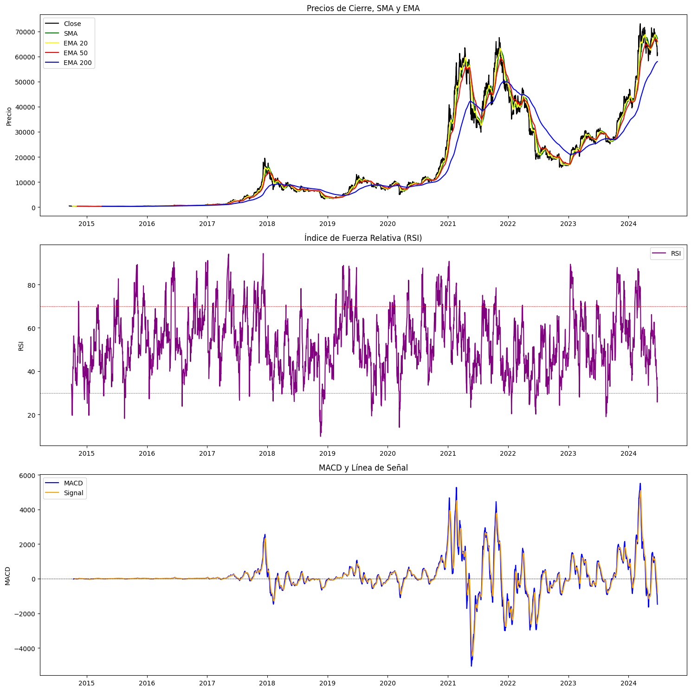

# Crypto Price Forecasting Using Autoformer

Experimental Bitcoin closing price forecasting project using time-series techniques, technical indicators, and deep learning models. The repository documents the full workflow, from downloading historical BTC-USD data to visualizing predictions and comparing model errors.

> This project is intended for academic and research purposes only. It is not financial advice and should not be used as the sole basis for investment decisions.

## Objective

The main goal is to build and evaluate a BTC-USD forecasting pipeline that can:

- Download and prepare historical Bitcoin data from Yahoo Finance.
- Analyze the evolution of the daily closing price.
- Compute technical indicators such as SMA, EMA, RSI, and MACD.
- Prepare time windows for supervised learning.
- Train time-series forecasting models.
- Compare predicted prices against actual prices on a test set.
- Evaluate performance using metrics such as MSE, MAE, RMSE, and R2.

## Overview

The main notebook is:

[`Crypto price forecasting using Autoformer.ipynb`](Crypto%20price%20forecasting%20using%20Autoformer.ipynb)

The implemented workflow includes:

1. Downloading `BTC-USD` data with `yfinance`.
2. Cleaning the dataset and selecting relevant variables.
3. Visualizing the historical closing price.
4. Computing technical indicators.
5. Normalizing the dataset with `MinMaxScaler`.
6. Building time windows with a 7-day lookback.
7. Creating a chronological train/test split.
8. Training a recurrent model in PyTorch.
9. Running an additional forecasting experiment with `amazon/chronos-t5-tiny`.
10. Comparing results visually and numerically.

## Dataset

The included [`BTC-USD.csv`](BTC-USD.csv) file contains daily Bitcoin market data downloaded from Yahoo Finance.

- Asset: `BTC-USD`
- Frequency: daily
- CSV date range: 2014-09-17 to 2024-07-08
- Original variables: `Open`, `High`, `Low`, `Close`, `Adj Close`, `Volume`
- Target variable: `Close`


## Exploratory Analysis

The project includes charts for reviewing BTC's historical trend and the behavior of technical indicators.


Computed indicators:

- Simple Moving Average: `SMA`
- Exponential Moving Averages: `EMA 20`, `EMA 50`, `EMA 200`
- Relative Strength Index: `RSI`
- Moving Average Convergence Divergence: `MACD` and `MACD Signal`



## Models and Experiments

### Recurrent Model in PyTorch

A recurrent architecture based on `torch.nn.LSTM` is built to model temporal dependencies from normalized time windows. The training setup uses:

- Loss function: `MSELoss`
- Optimizer: `Adam`
- Learning rate: `0.001`
- Epochs: `30`
- Batch size: `16`
- Lookback: `7` days

### Forecasting with Chronos

The notebook also includes an experiment with `amazon/chronos-t5-tiny`, using `ChronosPipeline` to generate a 31-day forecast horizon and a quantile-based prediction interval.


### Autoformer Reference

The notebook keeps a reference training command for Autoformer with a 31-day prediction horizon:

```bash
python -u BTC-FORECAST.py \
  --is_training 1 \
  --root_path ./dataset/Cryto/ \
  --data_path BTC-USD.csv \
  --model_id BTC_96_31 \
  --model Autoformer \
  --data custom \
  --features M \
  --seq_len 96 \
  --label_len 48 \
  --pred_len 31 \
  --e_layers 2 \
  --d_layers 1 \
  --factor 3 \
  --enc_in 1 \
  --dec_in 1 \
  --c_out 1 \
  --des BTC_Price_Prediction \
  --itr 1 \
  --train_epochs 100
```

## Results

On the 31-day test set, the main experiment obtained:

| Metric | Value |
| --- | ---: |
| MSE | 2,326,499.88 |
| RMSE | 1,525.29 |
| MAE | 1,273.61 |
| R2 | 0.8514 |

Comparison recorded in the notebook:

| Model | MSE | MAE |
| --- | ---: | ---: |
| Autoformer | 2,326,499.88 | 1,273.61 |
| LSTM | 96,413,480.00 | 8,289.03 |


Actual prices vs. predicted prices:


## Repository Structure

```text
.
├── BTC-USD.csv
├── Crypto price forecasting using Autoformer.ipynb
├── *.png
├── PDF/
│   └── Reference papers and documents
└── Price-Forecasting-Chronos-T5
```

## Installation

Using a Python virtual environment is recommended.

```bash
python3 -m venv .venv
source .venv/bin/activate
pip install --upgrade pip
```

Install the main dependencies:

```bash
pip install notebook pandas numpy matplotlib seaborn scikit-learn torch transformers yfinance ta chronos-forecasting
```

If you run Chronos on GPU, make sure your PyTorch installation is compatible with your CUDA version.

## Usage

1. Clone the repository:

```bash
git clone https://github.com/Ivo196/Crypto-Price-Forecasting-Using-Autoformer.git
cd Crypto-Price-Forecasting-Using-Autoformer
```

2. Open the notebook:

```bash
jupyter notebook "Crypto price forecasting using Autoformer.ipynb"
```

3. Run the cells in order to:

- Download or load `BTC-USD.csv`.
- Compute technical indicators.
- Prepare training and test data.
- Train the model.
- Generate predictions.
- Evaluate and plot the results.

## References

The [`PDF`](PDF/) folder includes papers and documents used as theoretical references, including work on Autoformer, Transformers for time series, Chronos, and financial forecasting.

## Future Work

- Move notebook code into reusable scripts.
- Add a `requirements.txt` or `environment.yml` file.
- Standardize model naming across all charts.
- Add walk-forward validation to evaluate temporal robustness.
- Include backtesting and comparisons against simple baseline models.
- Document complete Autoformer experiments with checkpoints and configuration files.

## License

This repository does not currently include an explicit license. Add an appropriate license before reusing or distributing the project.
